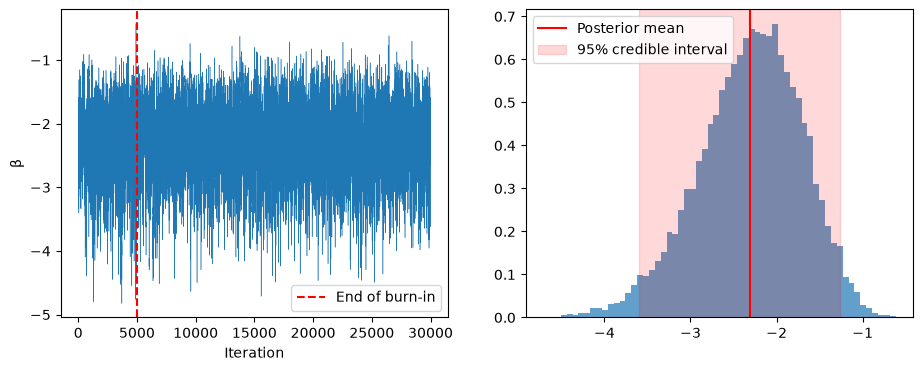
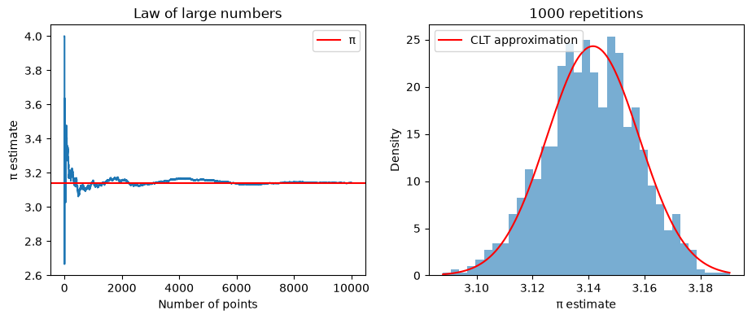
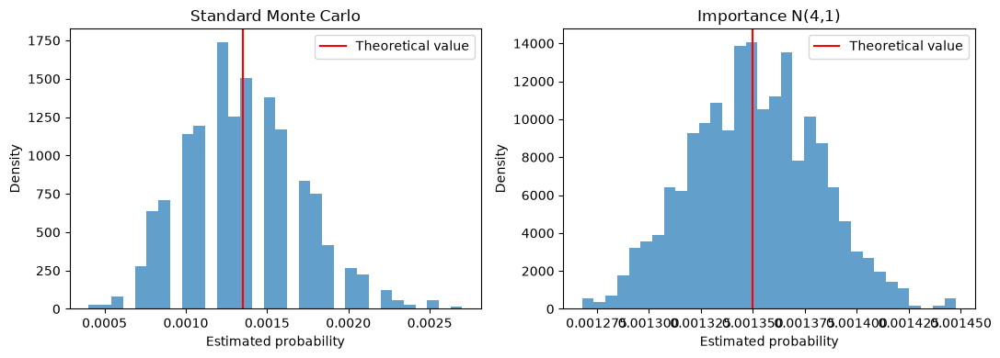
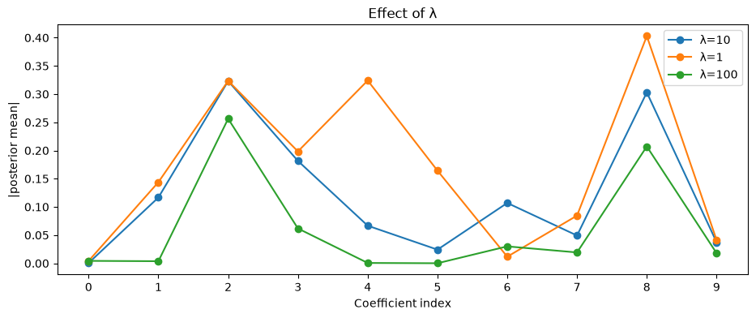
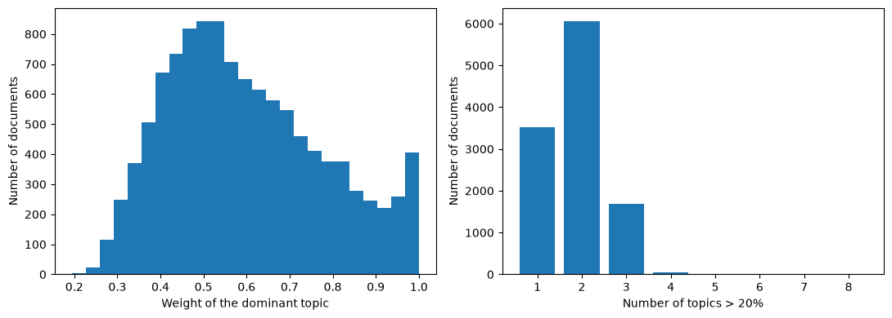

# Advanced statistical estimation: Monte Carlo, MCMC and variational inference

Four labs from the Advanced Statistical Estimation course at Centrale Lille, going from sampling random variables to Bayesian inference: Monte Carlo methods, a Metropolis-Hastings sampler, a Gibbs sampler for the Bayesian LASSO, and variational inference in Latent Dirichlet Allocation.



## Highlights

- **Random variable generation**: inverse transform, Box-Muller, Cholesky, acceptance-rejection, with the curse of dimensionality made explicit (acceptance probability 0.82 in 1D, 2 × 10⁻⁹ in 100D).
- **Monte Carlo and importance sampling**: π estimated with the CLT spread checked (0.01657 observed vs 0.01642 predicted), and a **139-fold variance reduction** on a Gaussian tail probability.
- **Metropolis-Hastings** for a Bayesian logistic regression: effect of the proposal width and of the starting point, posterior mean −2.309 with a 95% credible interval.
- **Gibbs sampler for the Bayesian LASSO** on the diabetes dataset, with posterior predictive distribution and the shrinkage effect of λ.
- **LDA with online variational inference** on 11,314 20 Newsgroups posts: topic interpretation and document-topic mixtures.

## Contents

| Lab | Topic | Main concepts |
|---|---|---|
| [Lab 1](lab1/lab1.ipynb) | Random variable generation | inverse transform, Box-Muller, Cholesky, acceptance-rejection, Monte Carlo, importance sampling |
| [Lab 2](lab2/lab2.ipynb) | MCMC (part 1), Metropolis-Hastings | random-walk proposal, burn-in, trace plots, MMSE, credible interval |
| [Lab 3](lab3/lab3.ipynb) | MCMC (part 2), Gibbs sampling | Bayesian LASSO, conditional distributions, posterior predictive, shrinkage |
| [Lab 4](lab4/lab4.ipynb) | Variational inference | Latent Dirichlet Allocation, bag of words, topics, document-topic proportions |

## Repository layout

```text
.
├── lab1/lab1.ipynb
├── lab2/lab2.ipynb
├── lab3/
│   ├── lab3.ipynb
│   └── park-casella.pdf        # Park and Casella (2008), The Bayesian Lasso
├── lab4/
│   ├── lab4.ipynb
│   ├── LDA.pdf                 # description of the LDA model used in the lab
│   └── sklearn_data/           # cached 20 Newsgroups corpus (runs offline)
├── docs/                       # Figures used in this README
└── requirements.txt
```

## Run it

```bash
pip install -r requirements.txt
jupyter notebook lab1/lab1.ipynb
```

Open each notebook from its own folder and run the cells in order. All outputs and figures are saved; fitting LDA on the full corpus in Lab 4 takes a few minutes.

## Context

Coursework for the Advanced Statistical Estimation course, Centrale Lille. The lab statements were provided by the teaching staff; the answers, code and analysis are my own. The two reference papers are included for convenience and remain the property of their authors. More on my [portfolio](https://ugo-roccamatisi.github.io).

## Gallery

| | |
|---|---|
|  |  |
|  |  |
